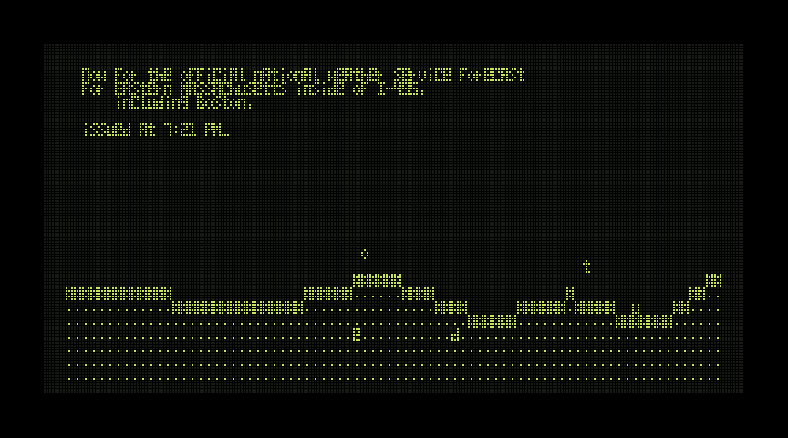
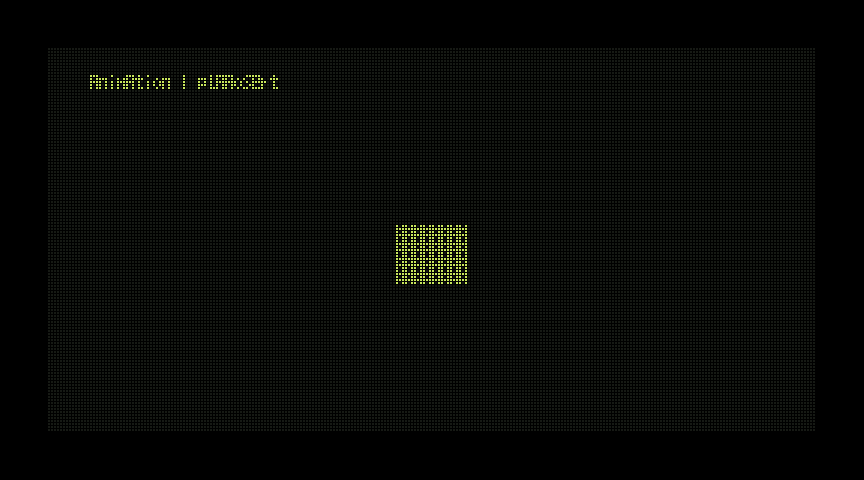

# VFD 显示与音频

在项目根目录构建并运行：

```powershell
./tools/build.ps1 -SDL
./build/host/credits_sdl.exe --audio ./credits.wav
```

`P` 暂停/恢复，`,`、`.`、`/` 沿用原始快进规则（首次快进只设锁存，随后每次输入轮询追加 3/7/15 拍）；`1`–`6` 从相应章节重新初始化，`Esc` 或关闭窗口退出。默认从头播放；`--jump 2` 直接跳到标题。`--seed N` 控制初始化。结束由 WAV 播放完决定。

无 SDL 的核心/终端构建：`./tools/build.ps1 -BuildDir build/core`。原终端程序仍为无音频时钟驱动；带音乐请运行 credits_sdl。

## 显示

核心输出 256×128、1bpp、MSB-first、32 字节 stride，共 4096 字节。用户 HTML 字体的保存数据直接导出，不执行脚本；ASCII 32–126 共 95 个 3×5 字形，190 字节只读数据。80×24 字符以 3×5 步进居中于 (8,4)。NBSP 映射为空格，缺字见 [GLYPH_TODO.md](GLYPH_TODO.md)。

单色规则：非黑色前景笔画点亮；普通/暗黑色笔画熄灭，亮黑色笔画点亮；彩色背景点亮、默认/黑背景熄灭。颜色转换、文字及所有业务绘制在核心；SDL 只展开 framebuffer 并整体上传纹理。

VFD 发光色 RGB (200,230,92)，未发光点 (22,25,20)。每点 2×2 实际像素、步进 3；间隔和四周 48 像素边框纯黑。固定 864×480 客户区。截图选项 `--snapshot build/vfd.bmp` 在运行 1.5 秒后回读实际 SDL 渲染目标，逐像素检查 RGB 与上传数据一致，再保存 BMP。

## 时间和音频

原时间常数保留：179 BPM，每拍八个更新，间隔 60/179/8 秒；偏移 5.492 秒。没有通过改 BPM 掩盖终端输出瓶颈。player_sync 接收音频位置，执行全部到期逻辑帧（包括 RNG、场景和绘制），每轮仅呈现最新结果。历史 player_step 保留以逐调用比较原 Python。

SDL_LoadWAV 解码/加载用户 WAV，SDL 音频队列提交原格式样本；播放位置由已提交字节减未消耗队列字节得到。暂停停止设备，快进清除队列并重新定位到完整样本边界；EOF 精确到最后一个样本。队列目标 8192 样本帧，设备请求 512 帧。

这是设备消费时钟，避免独立墙钟长期漂移。SDL2 不暴露扬声器实际播放游标：驱动/设备缓冲的固定延迟及窗口扫描延迟仍存在，未进行麦克风/回环物理测量；不能声称零毫秒声画误差。当前不额外加入未经测量的校准偏移。

## 内存与依赖

WAV 由主机 Audio 唯一拥有，关闭时 SDL_FreeWAV。当前整曲 PCM 为 49,188,288 字节；队列最多 32768 字节（设备内部缓冲另计）。像素展开缓冲 1,658,880 字节，SDL 纹理/驱动分配额外计算。截图临时增加同尺寸缓冲。核心 Credits 21,808 字节、framebuffer 4096 字节；没有把音频/显示缓冲塞入核心。当前选择整曲加载以保持实现清晰，尚未实施音频流式文件读取。

本机 SDL2 2.32.10 官方 MinGW 开发包位于 `.tools/SDL2-2.32.10`，CMake 复制对应 SDL2.dll 到构建目录。来源：
https://github.com/libsdl-org/SDL/releases/download/release-2.32.10/SDL2-devel-2.32.10-mingw.zip

ZIP SHA-256：`f15cff5fca62ec9381a016ef1d42a95c638cd72d2f226ba5781c76fe43dbd1ac`。工具和音频不提交 Git。已有 LLVM-MinGW 工具链的安装记录见 TERMINAL.md。这里只实际验证 Windows x64；其他平台未实测。

诊断：`CREDITS_TIMING_LOG` 可记录终端核心/输出耗时与待追赶时间。SDL 退出时报告音频位置、呈现帧数、最大补帧计算耗时、积压、缺字次数和核心分配峰值。`--seconds N` 限制测试运行时间；`--scripted` 用于自动暂停/恢复/快进测试。


核心实际输出预览（seed 1，250/1200 拍；与 SDL 相同像素展开）：




